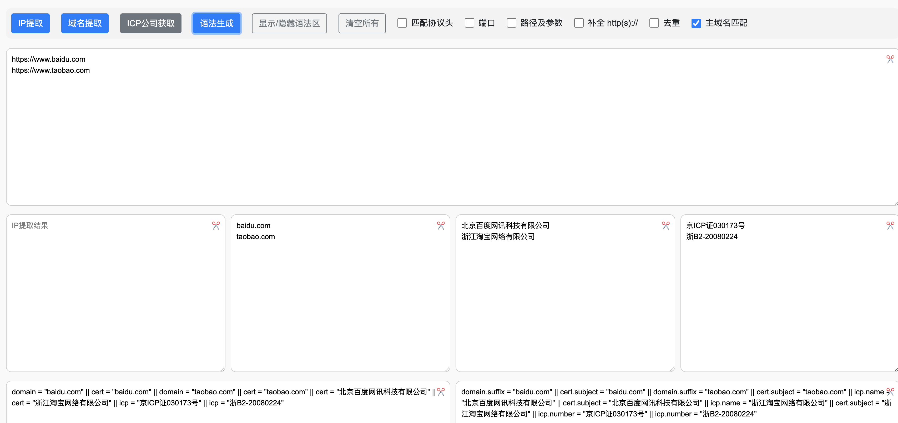

# Idregex

两个IP域名提取小工具，一个网页版，一个Python脚本版。

## 1. html+js



**更新日志** 2023-09-25

- Ajax 请求解析域名对应站点ICP公司名称信息（备案号暂时实现不了，好多查询接口都是鉴权的，只能手动输入）
- 新增fofa、hunter搜索引擎的语法生成功能

**更新日志** 2023-03-30

- IP提取增加路径以及参数的匹配
- 优化路径匹配，当前只能匹配IP域名中带有路径信息路径匹配

**更新日志** 2023-03-22

- 增加路径以及参数的匹配
- 新增17种协议头识别：`(file,ftp,gopher,glob,expect,mailto,mms,ed2k,flashget,thunder,news,php,bzip2,data,Zlib,ssh2,zip)`。
- 新增主域名匹配可识别国内常见主域名，可识别常见27个二级域名。
- 优化JS判断流程


## 2. Py scripts

### 2.1 需求场景

大批量服务器文本日志筛选IP域名，从而关联恶意IOC样本。

### 2.2 优点:

- 支持多线程跑文件
- 10M以上大文本文件分割读取

### 2.3 用法

```shell
python extract.py -f D:\\1.txt -a -p -D -t
```

**注意：**提取的结果是保存在当前目录中，result.csv。

```shell
-f, --file            only set one file to be extracted
-d, --directory       set a directory to be extracted
-D, --delete          Delete Duplicates 
-i,--only-ip          only extract IP
-n,--only-domain      only extract domain name
-a,--all              extract all, include extract IP and extract domain name
-t,--protocol type    matching protocol type, eg:http://127.0.0.1 
-p,--port             matching port,eg:127.0.0.1:1001
-h, --help            display this help and exit
```

